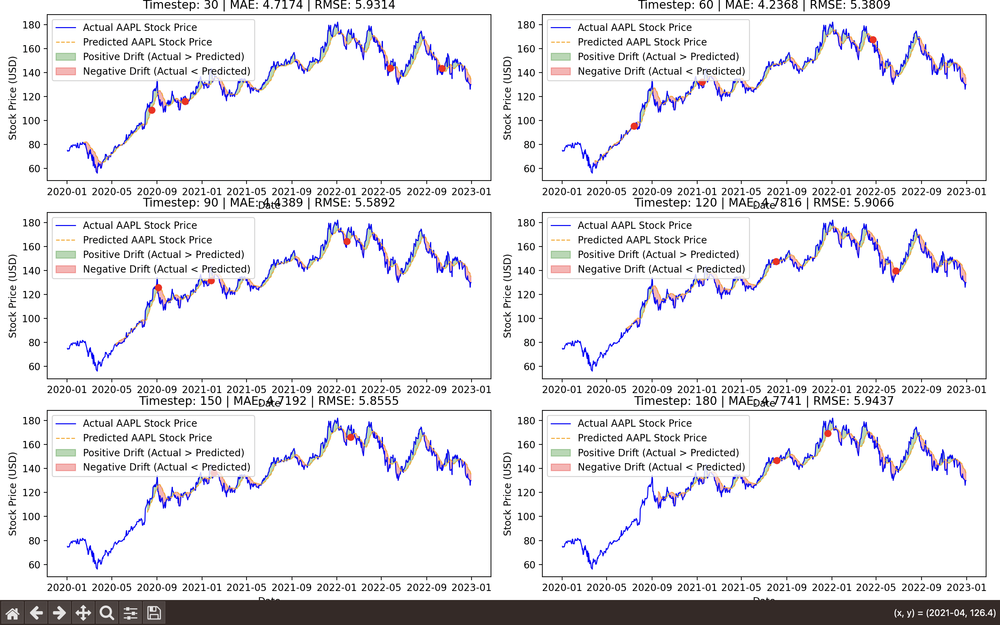

# Drift Detection and Trading Metrics

This repository demonstrates drift detection, feature visualization using Evidently, and trading metrics analysis through stock price predictions using an LSTM model.

## Stock Price Prediction using LSTM and Drift Analysis

### Overview
The script `drift_detection/LSTM_calculate_metrics.py` utilizes an LSTM model to predict Apple's stock price (AAPL) and perform drift analysis by comparing model performance across various time steps. The results highlight areas where the model's predictions deviate from the actual stock prices.

### Workflow
1. **Data Collection**: 
   - Download historical AAPL stock data using the `yfinance` library.
   
2. **Data Preprocessing**: 
   - Normalize the 'Close' prices using MinMaxScaler.
   - Create a sliding window dataset for time series forecasting.

3. **Model Training**: 
   - Train LSTM models for different time steps (30, 60, 90, 120, 150, 180) to predict stock prices.
   
4. **Prediction & Drift Analysis**: 
   - Make predictions on the historical data using the trained models.
   - Visualize actual vs. predicted stock prices and highlight drift areas where predictions deviate from actual prices.

5. **Performance Metrics**: 
   - Compute key performance metrics:
     - **MAE** (Mean Absolute Error)
     - **RMSE** (Root Mean Squared Error)
     - **MSE** (Mean Squared Error)
     - **MAPE** (Mean Absolute Percentage Error)
     - **R²** (R-squared)

### Outputs
- **Subplots**: Visual comparison of actual vs. predicted stock prices, with areas of drift highlighted for each time step.
    

- **Metrics Table**: A summary of the performance metrics (MAE, RMSE, MAPE, and R²) for each time step.

### Usage
1. Install the required dependencies:
   ```bash
   pip install -r requirements.txt
2. Run the script to train the LSTM model, make predictions, and visualize the results:
    ````bash
    python drift_detection/LSTM_calculate_metrics.py

