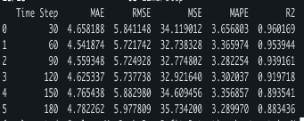
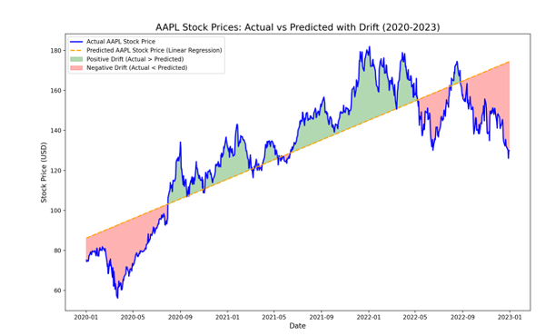

# Drift Detection and Trading Metrics

This repository demonstrates drift detection, feature visualization using Evidently, and trading metrics analysis through stock price predictions using an LSTM model.

## Stock Price Prediction using LSTM and Drift Analysis

### Overview
The script `drift_detection/LSTM_calculate_metrics.py` utilizes an LSTM model to predict Apple's stock price (AAPL) and perform drift analysis by comparing model performance across various time steps. The results highlight areas where the model's predictions deviate from the actual stock prices.

### Workflow
1. **Data Collection**: 
   - Download historical AAPL stock data using the `yfinance` library.
   
2. **Data Preprocessing**: 
   - Normalize the 'Close' prices using MinMaxScaler.
   - Create a sliding window dataset for time series forecasting.

3. **Model Training**: 
   - Train LSTM models for different time steps (30, 60, 90, 120, 150, 180) to predict stock prices.
   
4. **Prediction & Drift Analysis**: 
   - Make predictions on the historical data using the trained models.
   - Visualize actual vs. predicted stock prices and highlight drift areas where predictions deviate from actual prices.

5. **Performance Metrics**: 
   - Compute key performance metrics:
     - **MAE** (Mean Absolute Error)
     - **RMSE** (Root Mean Squared Error)
     - **MSE** (Mean Squared Error)
     - **MAPE** (Mean Absolute Percentage Error)
     - **R²** (R-squared)

### Outputs
- **Subplots**: Visual comparison of actual vs. predicted stock prices, with areas of drift highlighted for each time step.
    

- **Metrics Table**: A summary of the performance metrics (MAE, RMSE, MAPE, and R²) for each time step.
    

### Usage
1. Install the required dependencies:
   ```bash
   pip install -r requirements.txt
2. Run the script to train the LSTM model, make predictions, and visualize the results:
    ````bash
    python drift_detection/LSTM_calculate_metrics.py


## Stock Price Prediction using Linear Regression for clear understanding about Drift 



## Trading Metrics

## Overview
Trading_metric/trading_metrics.py fetching stock data, processing it, generating technical indicators, and running a backtest using Vectorbt. It calculates key trading metrics such as Sharpe Ratio and visualizes indicators like Moving Averages, RSI, and MACD.

## Workflow

1. **Data Collection**: 
   - Fetch stock data from an API using asyncio and requests.

2. **Data Processing**: 
   - Normalize stock data and clean missing values.

3. **Technical Indicators**: 
   - Generate EMA, RSI, and MACD using Vectorbt.

4. **Backtesting**: 
   - Run a trading strategy based on moving average crossovers.

5. **Trading Metrics**: 
   - Calculate Total Return, Max Drawdown, Volatility, Sharpe Ratio, and Sortino Ratio.

6. **Visualization**: 
   - Plot stock prices, moving averages, entry/exit points, RSI, and MACD.

### Outputs


## Feature distribution visualization using evidently
## Overview

feature_distribution_visualization/evalute_drift_with_evidently.py ingests time series data from an API, preprocesses it, trains a predictive model, and evaluates drift between historical and current data using various statistical tests. The drift metrics include:
- Kolmogorov-Smirnov (KS) Test
- Population Stability Index (PSI)
- Kullback-Leibler Divergence (KL Divergence)
- Jensen-Shannon Divergence
- Wasserstein Distance

### Outputs


### Statest test


## Reason for unable touse stock splits
I noticed that after stock splits, the price of the stock should typically decrease due to the proportional adjustment. However, in many cases, the share price increased following the split. This makes the dataset more challenging to use as a reference for drift detection because the expected price behavior doesn't align with the general stock split mechanism.

