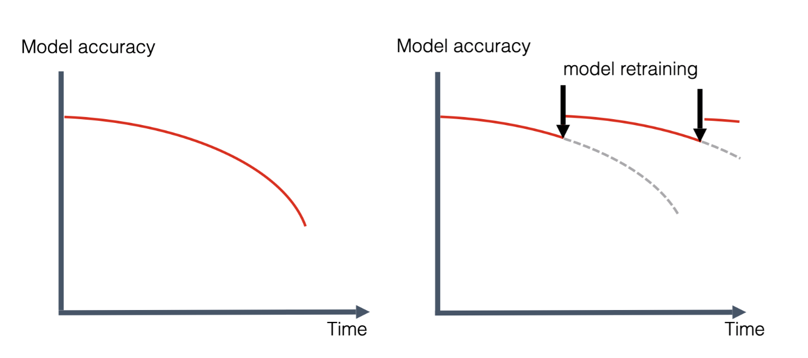
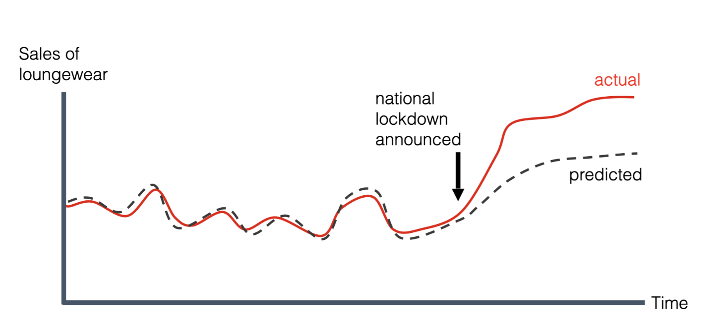
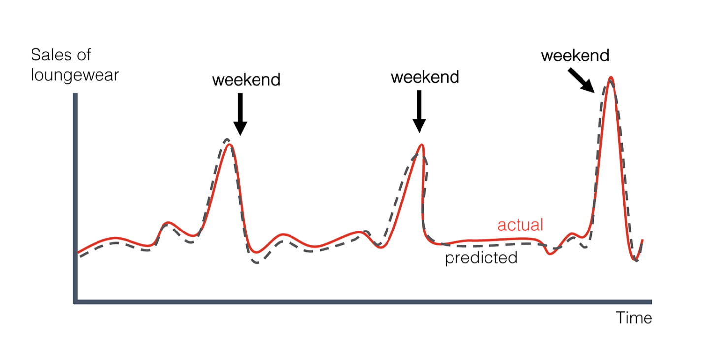
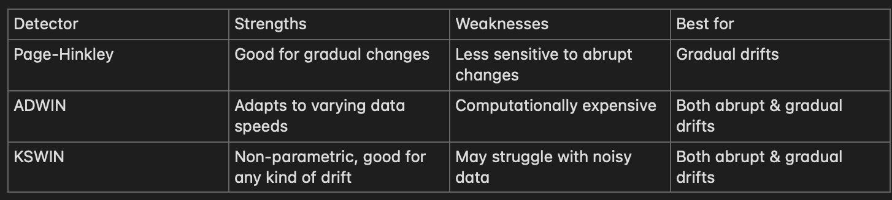
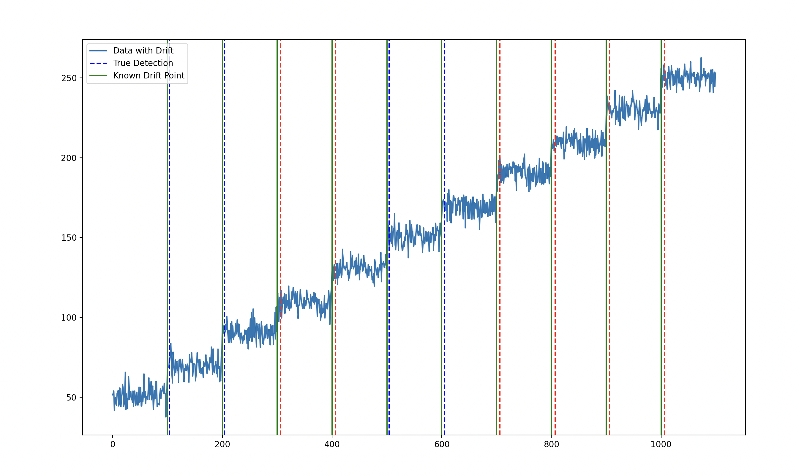
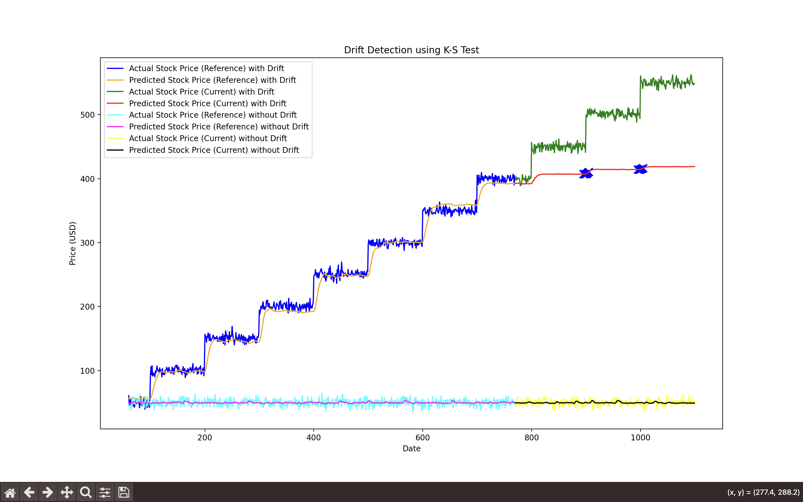
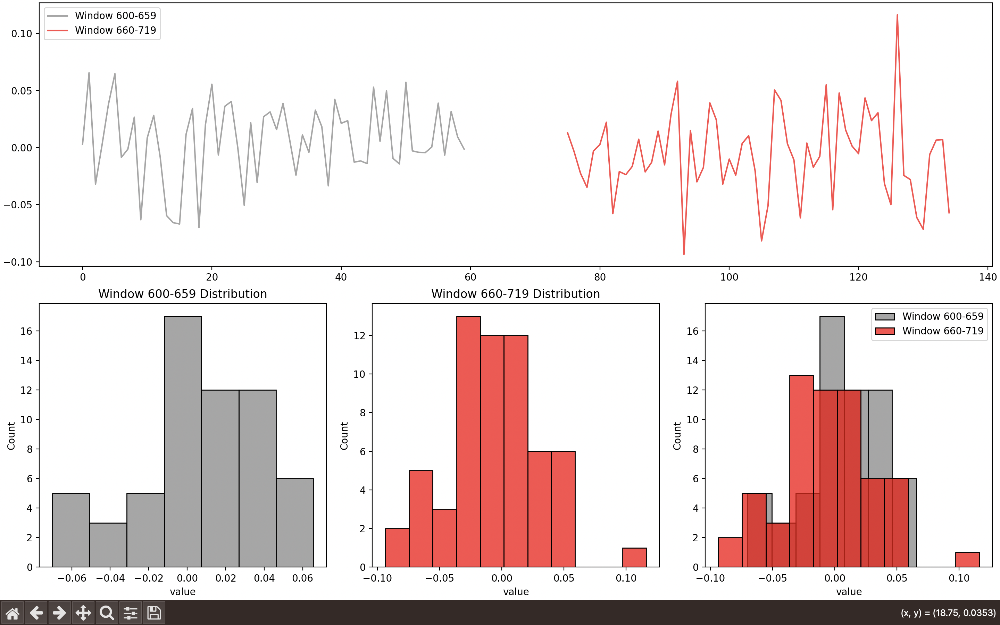
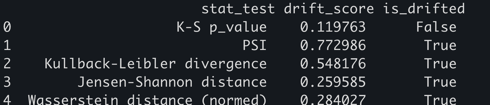
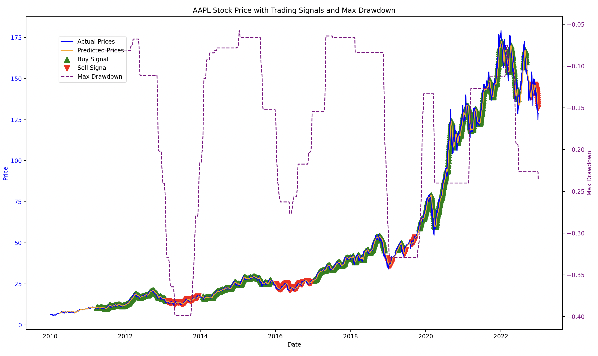
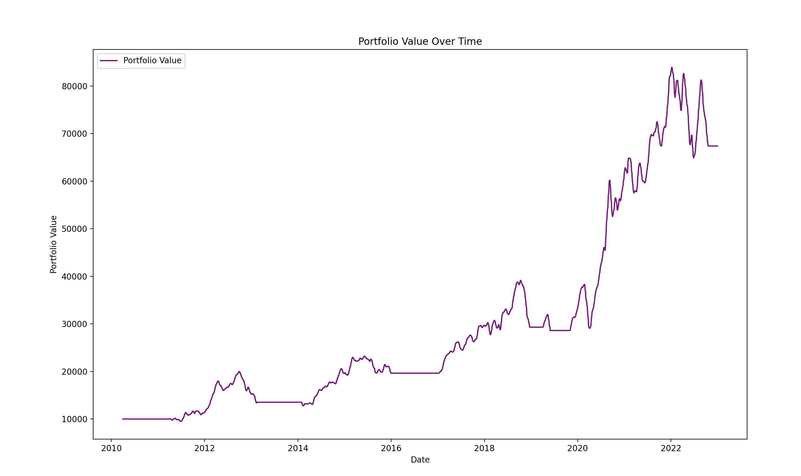

# Stock Price Prediction and Drift Detection using LSTM

This repository demonstrates the use of an LSTM (Long Short-Term Memory) model to predict Apple's stock prices (AAPL) and detect performance drift, distribution drift detection, and trading over time using various drift detection algorithms such as Page-Hinkley, ADWIN, KSWIN, and Evidently AI.

## Prerequisites

**Concept Drift** is a change in the relationship between the input data and the model target. It reflects the evolution of the underlying problem statement or process over time. Simply put, whatever we are trying to predict – it’s changing.[P(Y|X)]

**Types of concept drift**
There are different types of concept drift patterns one can observe in production. Let’s dive into those and explore some examples.

**Gradual concept drift**
When referring to “drift,” we usually expect a gradual change. After all, this is what the word itself means – a slow change or movement. This is the most frequent type of drift indeed. Gradual drift happens when the underlying data patterns change over time. 

**Sudden concept drift**
Sudden concept drift is the opposite: an abrupt and unexpected change in the model environment. 

**Recurring concept drift**
Recurring concept drift, meaning pattern changes that happen repeatedly or follow a cycle. 

**Concept Drift vs. Model Drift**: Model drift is the decrease in model quality without a specified cause. Concept drift implies a change in the learned relationships. Model drift is often caused by concept drift.

- **Drift Detection Algorithm Strengths and Weaknesses**
      

**Page-Hinkley (PH)** Page-Hinkley is a sequential analysis technique primarily used for detecting abrupt changes (drift) in the average of a signal. It was originally designed for quality control but is now adapted to concept drift detection in machine learning models.

**ADWIN (Adaptive Windowing)** ADWIN is a robust algorithm designed for detecting both abrupt and gradual drifts in a data stream. It is a sliding window-based method that automatically adjusts its window size based on the presence of drift.

**KSWIN (Kolmogorov-Smirnov Windowing)** KSWIN is a non-parametric drift detection algorithm based on the Kolmogorov-Smirnov (K-S) test, which measures the distance between two probability distributions. It is designed for detecting changes in data distribution using statistical hypothesis testing.

# Concept Drift Detection Methods

   Concept drift occurs when the statistical properties of the target variable, which the model is predicting, change over time. Detecting concept drift is crucial for maintaining the performance of machine learning models. This document outlines several effective methods for detecting concept drift.

## Methods

### 1. Monitor Model Quality Metrics
   Track key performance metrics such as accuracy, precision, recall, and F1-score. A significant drop in these metrics can indicate that concept drift is occurring.

### 2. Use Proxy Metrics
   Observe changes in the distribution of predictions and predicted probabilities.
   These metrics can serve as early warning signs of potential drift.

### 3. Statistical Tests
   Apply statistical tests like the Kolmogorov-Smirnov test or Chi-Square test.
   Compare current data distributions with historical distributions to detect drift.

### 4. Distance Metrics
   Measure the differences between distributions using metrics like Wasserstein Distance or Population Stability Index (PSI).
   A breach of predefined thresholds indicates possible drift.

### summary
If the model's predictions in the current period are significantly worse than in the reference period, it suggests that the model's assumptions have become outdated, indicating concept drift.

## Overview

 The visualization of drift detection shows this script feature_distribution_visualization /page_hinkle_test_1.py

Testing on synthetic data with known drift demonstrates the algorithm's ability for drift detection. The feature distribution visualization can be found in /page_hinkley_test_2.py.

feature_distribution_visualization /window_based_using_evidently.py  shows window based drift detection

## Trading 

The `Trading_strategy.py` script fetches historical stock data, preprocesses it, trains an LSTM model to predict future prices, generates trading signals based on performance metrics, simulates a trading strategy, and visualizes the results. It also includes additional analysis for higher predictions and sell/buyback opportunities, and uses statistical methods to make informed trading decisions.

## Features

- Fetches historical stock data for Apple Inc. (AAPL) from Yahoo Finance.
- Preprocesses and scales the data.
- Creates datasets suitable for LSTM model training.
- Trains an LSTM model to predict future stock prices.
- Generates buy and sell signals based on performance metrics.
- Simulates a trading strategy based on the generated signals.
- Visualizes actual and predicted stock prices, trading signals, and portfolio value.
- Analyzes higher predictions and sell/buyback opportunities.

### Outputs
Number of predictions higher than the current value: 264

---

Average percentage growth for higher predictions: 2.84%

---

Sell opportunities found: 288

---

Average potential gain from sell opportunities: -0.61

---

Shares to buy: 50

---

Current price is not high enough to justify a sell.

---

Shares to sell: 0