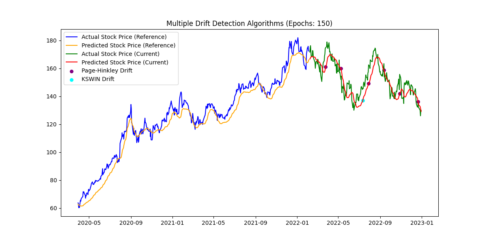

# Stock Price Prediction and Drift Detection using LSTM

This repository demonstrates the use of an LSTM (Long Short-Term Memory) model to predict Apple's stock prices (AAPL) and detect performance drift, distribution drift detection, and trading over time using various drift detection algorithms such as Page-Hinkley, ADWIN, and KSWIN.

## Overview

feature_distribution_visualization /comparison_between_epochs_different_drift.py uses an LSTM model to make stock price predictions and analyzes model performance over time. Drift detection algorithms are used to identify periods where the model's prediction errors exceed a reference deviation, signaling changes in stock price behavior and model underperformance.

## Features

- **Stock Price Prediction**: Predict future stock prices using a trained LSTM model.
- **Drift Detection**: Identify points where the model's prediction errors exceed the reference deviation using drift detectors (Page-Hinkley, ADWIN, KSWIN).
- **Performance Metrics**: Calculate performance metrics such as MAE (Mean Absolute Error) and Maximum Deviation for both reference and current periods.
- **Visualization**: Plot actual and predicted prices, highlighting drift detection points.

## Workflow

1. **Data Collection**:
   - Fetch historical stock price data for Apple (AAPL) from Yahoo Finance using the `yfinance` library.
   
2. **Data Preprocessing**:
   - Normalize the stock 'Close' prices using `MinMaxScaler`.
   - Create time series datasets with sliding windows for LSTM training.

3. **LSTM Model Training**:
   - Train a multi-layered LSTM model with dropout and batch normalization to predict stock prices.
   - Experiment with different epoch values (50, 100, 150, 400) to compare performance.
   
4. **Prediction & Drift Detection**:
   - Split data into reference and current periods.
   - Calculate the maximum deviation between actual and predicted prices in the reference period.
   - Use drift detection algorithms to monitor the model's performance in the current period and detect drifts.

5. **Performance Evaluation**:
   - Compute key metrics such as MAE, Max Deviation, and analyze drift points for each drift detection algorithm.

## Performance Metrics

The following metrics are used to evaluate the LSTM model's prediction performance:
- **MAE (Mean Absolute Error)**: The average absolute difference between predicted and actual prices.
- **Max Deviation**: The maximum deviation between predicted and actual prices in the reference period.
- **Drift Points**: The points where drift detection algorithms identified significant changes in the model's performance.

## Visualization**:
   The plots include:
   - Actual vs. Predicted stock prices for both reference and current periods.
   - Drift detection points marked on the plots where each algorithm detected a drift.

### Outputs

- **Results based on different epoches and the drift algorithoms**:.
    
    
    
    

# Distribution based analysis by evidently

feature_distribution_visualization /aapl_data_synthetic_data_evidently.py demonstrates how to use synthetic data as a complementary dataset to Yahoo Finance data for comparison and drift detection using Evidently AI.

## Overview

The script performs the following tasks:
1. Fetches AAPL stock data from Yahoo Finance.
2. Preprocesses the data (e.g., calculates differences, applies Min-Max scaling).
3. Generates synthetic data that mimics the stock data.
4. Introduces drift in the synthetic prediction data.
5. Evaluates drift using Evidently AI.
6. Visualizes the original stock data, processed data, synthetic data, and drift detection in a single figure with subplots.

# Visualization 

This script visualizes the original stock data, processed data, synthetic data, and drift detection in a single figure with subplots. It demonstrates how Evidently AI can be used to detect drift in data.
### Plot the original stock data, processed data, synthetic data, and drift detection

### Distrubtion for prediction and target

## Trading Metrics

## Overview
Trading_metric/trading_metrics.py fetching stock data, processing it, generating technical indicators, and running a backtest using Vectorbt. It calculates key trading metrics such as Sharpe Ratio and visualizes indicators like Moving Averages, RSI, and MACD.

## Workflow

1. **Data Collection**: 
   - Fetch stock data from an API using asyncio and requests.

2. **Data Processing**: 
   - Normalize stock data and clean missing values.

3. **Technical Indicators**: 
   - Generate EMA, RSI, and MACD using Vectorbt.

4. **Backtesting**: 
   - Run a trading strategy based on moving average crossovers.

5. **Trading Metrics**: 
   - Calculate Total Return, Max Drawdown, Volatility, Sharpe Ratio, and Sortino Ratio.

6. **Visualization**: 
   - Plot stock prices, moving averages, entry/exit points, RSI, and MACD.

### Outputs

## Feature distribution visualization using evidently
## Overview

feature_distribution_visualization/evalute_drift_with_evidently.py ingests time series data from an API, preprocesses it, trains a predictive model, and evaluates drift between historical and current data using various statistical tests. The drift metrics include:
- Kolmogorov-Smirnov (KS) Test
- Population Stability Index (PSI)
- Kullback-Leibler Divergence (KL Divergence)
- Jensen-Shannon Divergence
- Wasserstein Distance

### Outputs

### Statest test

## Reason for unable to use stock splits
I noticed that after stock splits, the price of the stock should typically decrease due to the proportional adjustment. However, in many cases, the share price increased following the split. This makes the dataset more challenging to use as a reference for drift detection because the expected price behavior doesn't align with the general stock split mechanism.

